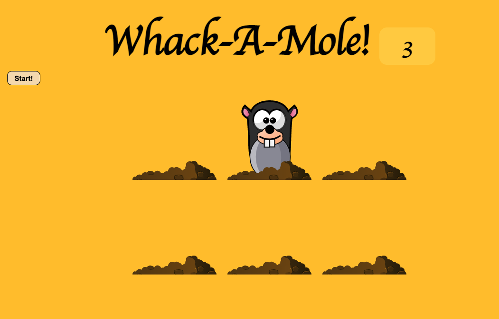

# Whack a Mole Game

## Proyecto nº 30 de #JavaScript30

Dándole al botón de "Start!", comenzarán a salir topos de sus agujeros. Hay que clickarles antes de que se vuelvan a esconder, e irá subiendo la puntuación conforme machaques a los topos.
<a href="https://nuriadiazcandela.github.io/Whack-A-Mole-Game/">Link</a>

</img>

---

 <footer> :computer: by Nuria :hammer: </footer>
